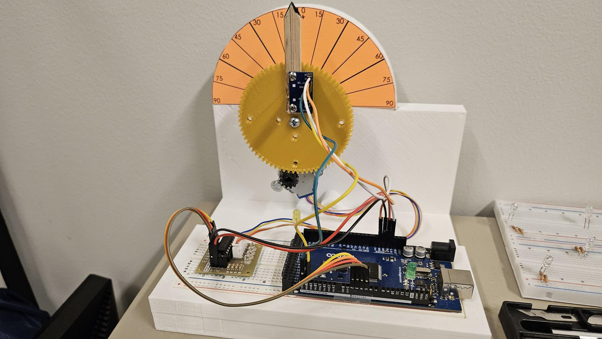

# satcontrol Readme
This is an activity for determining and controlling attitude of model satellite using Arduino. 

This activity makes use of an Arduino Mega as a microcontroller in order to determine attitude and control the angular motion of an actuator. The idea is to provide students with a physical hardware where they can test their attitude determination and control algorithm and realize that what works in simulation may not work when implemented on actual hardware. For simplicity, only one angle is being determined and controlled (pitch in this case). Note that the IMU being used for this project (MPU 6050) can only detect pitch and roll accurately by itself. For yaw, it needs to integrated with another sensor and a sensor fusion algorithm will be required. 

## Summary

This activity allows students to create their own attitude determination and control algorithms on MATLAB and Simulink and then testing it out on Arduino based physical hardware to determine if their algorithms work in the real world. 

## Materials and Software

1. 3D printing filament (PLA was used for this project). Designs are supplied in this github repo. 
2. Stepper motor (28BYJ-48, 5V DC motor)
3. Motor Driver board (ULN2003 Driver Board)
4. Arduino Mega
5. USB Type-B wire for power and data tranfer to the Arduino
6. Breadboard
7. Jumper wires
8. A PC (of course!) with MATLAB installed

")

## Background
This activity makes use of an Arduino Mega as a microcontroller in order to determine attitude and control the angular motion of an actuator. Students get to understand how attitude determination actually works, how filtering works in context of electronics and how hardware control execution is done. The idea is to provide students with a physical hardware where they can test their attitude determination and control algorithm and realize that what works in simulation may not work when implemented on actual hardware. MATLAB and Simulink is used for the coding of the program which is them uploaded to Arduino. Students need to think about how Simulink blocks come together and work with MATLAB for execution to take place. They need to understand the interface between the hardware and software and how data acquisiton and control takes place. It uses critical thinking and model development techniques.  This can further be used by students to give a quick 5 minute overview of what they achieved as a result of working on this activity. 

## Activity

1. Download the simulink code from the git repo
2. Install Simulink, and Support packages for Arduino Hardware from Mathworks for MATLAB and Simulink ([Arduino-MATLAB](https://www.mathworks.com/hardware-support/arduino.html), [Arduino-Simulink](https://www.mathworks.com/matlabcentral/fileexchange/40312-simulink-support-package-for-arduino-hardware))
3. Make appropriate breadboard connections (as shown in the image in the header section)
    Essentially, you would need to connect the IN1 through 4 to Arduino's ports 2 through 5 respectively. Connect the motor driver wires to the motor itself (it is a push connect fitting). 

4. Connect the electronics first and make sure they work. 
5. Once the electronics work with the software, download the CAD files (access folder "CAD Designs") and 3D print the models  and complete the assembly as shown in the image. 
6. You will need some hardware (nuts, bolts and washers) to make the setup functional. 

This activity was first formally presented in an attitude control course at Purdue University, School of Aeronautics and Astronautics, taught by Dr. Carolin Frueh ([Profile](https://engineering.purdue.edu/AAE/people/ptProfile?resource_id=111420)). The equipment and electronics for this activity was offered by the school as a part of a pilot project. 